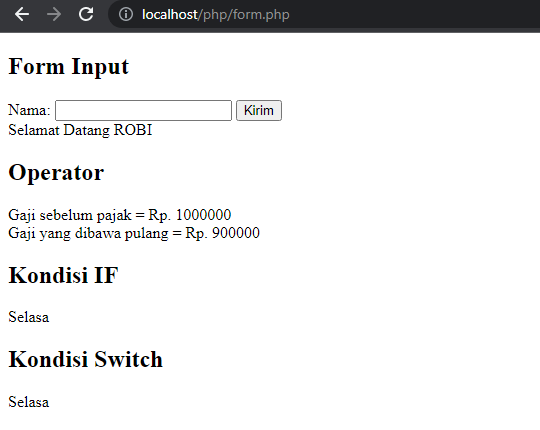

# PHP DASAR
Source Code Example Basic PHP

~Form Post Example Input Method POST

***PADA BAGIAN (dasar.php) 
== Merupakan gabungan antara html dan php untuk menampilkan Text" ==

***PADA BAGIAN (dasar2.php)
== Merupakan Gabungan HTML dan PHP untuk menampilkan data yang ada di meta PHP dan di tampilkan (echo) pada HTML

***PADA BAGIAN (dasar3.php)
== Merupakan Perintah untuk menampilkan variabel Nama yang sudah di Input pada Input Post.

***PADA BAGIAN (php_dasar.php)
== Merupakan Gabungan Perintah dari (dasar.php)*(dasar2.php)*(dasar3.php).

***PADA BAGIAN (code5.php)*(code6.php)*(code7.php)*(code8.php)*(code9.php)*(code10.php)..
== Merupakan perintah Satuan yang akan di gabungkan pada (form.php)

***PADA BAGIAN (form.php) 
== Merupakan hasil dari beberapa perintah (code.php) Input POST dan Menghasilkan dari input tersebut..

